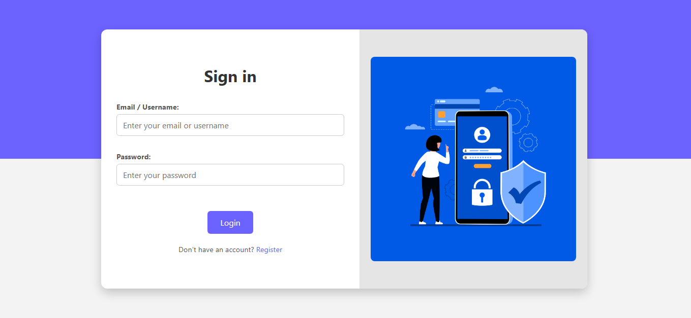
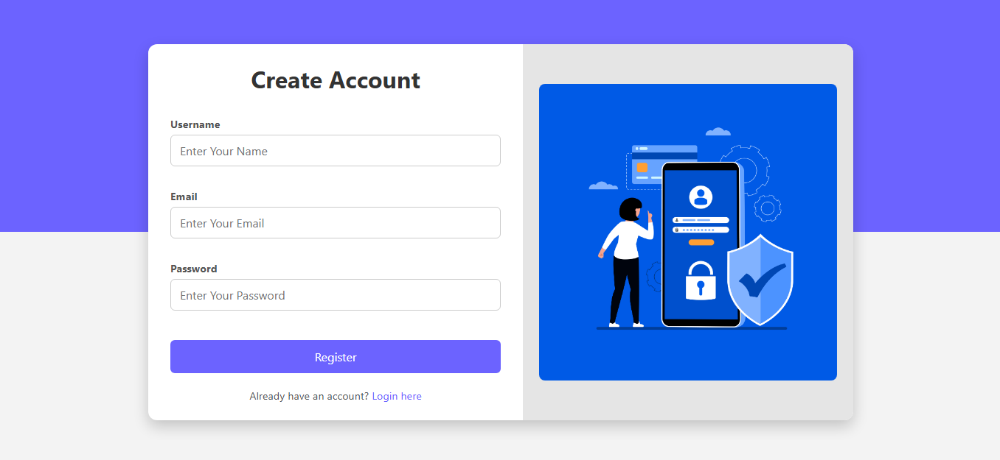
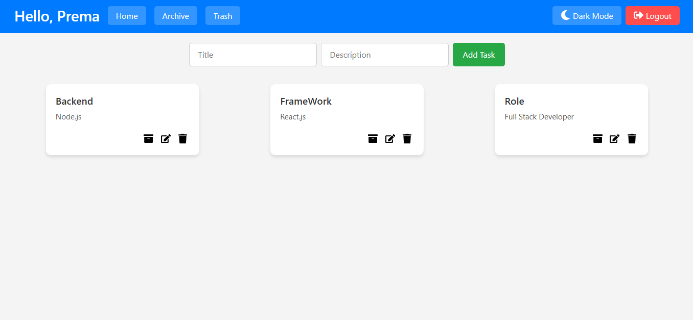
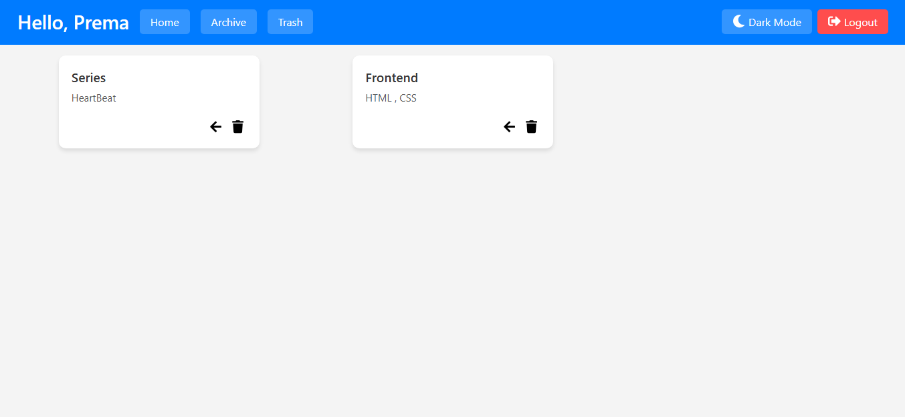
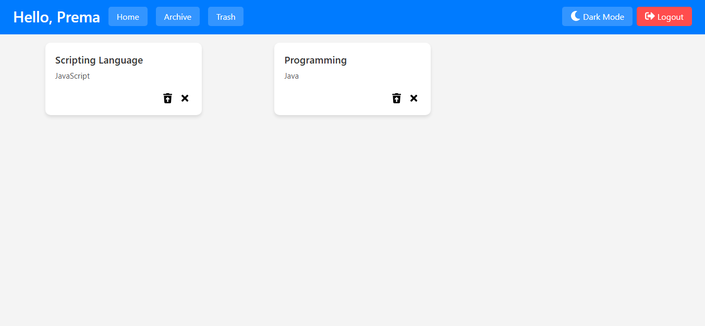
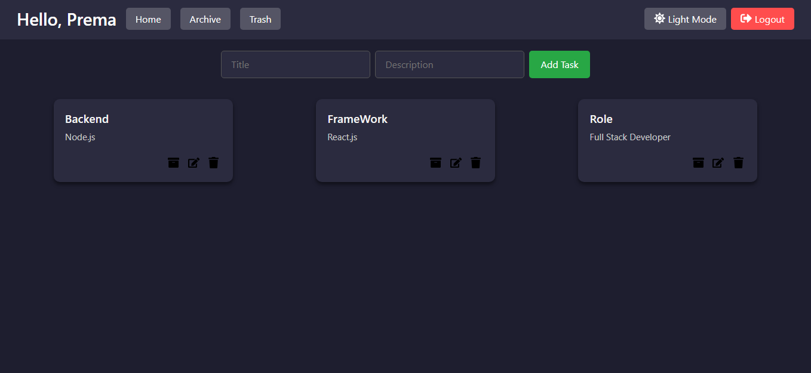

# Worknest – Task Manager

Worknest is a full-stack task management application built with *React.js, Node.js, Express, and MySQL*.  
It helps users securely manage tasks with features like authentication, task organization, archive, trash, and theme customization.

---

## 🚀 Features
- *User Authentication* – Register and login securely with JWT & bcrypt.  
- *Task Management* – Add, edit, archive, restore, and permanently delete tasks.  
- *Trash Section* – Soft delete tasks and restore them when needed.  
- *Dark/Light Theme* – Switch themes for better usability.  
- *Responsive Design* – Works across desktop, tablet, and mobile devices.  

---

## 🛠 Tech Stack
- *Frontend*: React.js, CSS  
- *Backend*: Node.js, Express.js  
- *Database*: MySQL  
- *Authentication*: JWT, bcrypt  
- *Deployment*: Netlify (frontend), Render (backend)  

---

## 📸 Screenshots

### 1. Home Page  

### 2. Login Page  

### 3. Register Page  

### 4. Dashboard  

### 5. Archive Section  

### 6. Trash Section  

### 7. Dark Theme  

---

## 🎥 Live Demo
👉 [Watch the Demo Video](https://drive.google.com/your-demo-link)  

---

## 👨‍💻 Author
*Prema Vengatesan*  
Full Stack Developer | React | Node.js | JavaScript | MySQL | MongoDB | HTML | CSS
📧 Email: premapleasant@gmail.com  
🔗 LinkedIn: [https://linkedin.com/in/prema-developer](https://linkedin.com/in/prema-developer)  
💻 GitHub: [https://github.com/premapleasant](https://github.com/premapleasant)  
🌐 Portfolio: [https://prema-portfolio.netlify.app](https://prema-portfolio.netlify.app)
